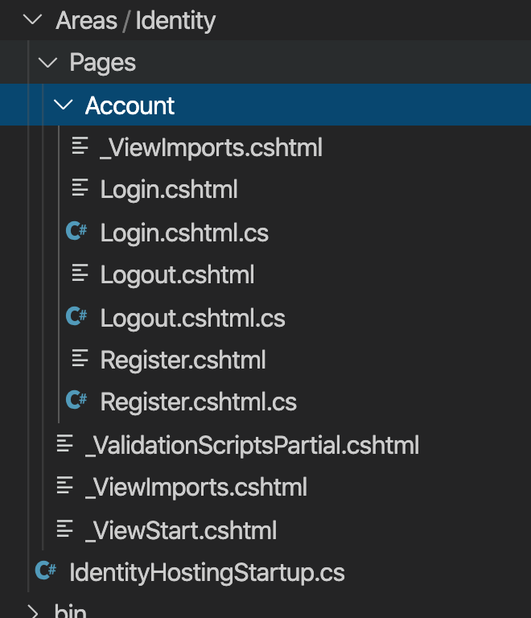

# Identity
- **Authentication**: Prove your identity
- **Authorization**: Defining what the user is allowed to do

# Authentication - Identity Setup

## create dotnet mvc app with auth 
```bash
dotnet new mvc --auth Individual
```

## install entity framework packages
```bash
dotnet add package Microsoft.EntityFrameworkCore.SqlServer


// - only if you want to use postgres:
// - postgress start
dotnet add package Npgsql.EntityFrameworkCore.PostgreSQL.Design
dotnet add package Npgsql.EntityFrameworkCore.PostgreSQL
// - postgress stop

dotnet add package Microsoft.EntityFrameworkCore.Design
```

## change default connection in appsettings.json

```json
{
  "ConnectionStrings": {
    "DefaultConnection": "DataSource=app.db"
  },
  "Logging": {
    "LogLevel": {
      "Default": "Information",
      "Microsoft": "Warning",
      "Microsoft.Hosting.Lifetime": "Information"
    }
  },
  "AllowedHosts": "*"
}
```


## for postgress
*This is an example default connection strings, update with your settings*
```json
"DefaultConnection": "Host=localhost;Port=54320;Database=de_mol;Username=homestead;Password=secret"
```
## for sql server

*This is an example default connection strings, update with your settings*

watch out: use a \\\\ in Data Source!

```json
"DefaultConnection": "Data Source=639GTQ2\\SQLEXPRESS;Initial Catalog=de_mol;Integrated Security=True;"  
```

## change options.UseSqslite in the ConfigureServices method in Startup.cs 

```C#
// This method gets called by the runtime. Use this method to add services to the container.
        public void ConfigureServices(IServiceCollection services)
        {
            services.AddDbContext<ApplicationDbContext>(options =>
                options.UseNpgsql( // CHANGED LINE
                    Configuration.GetConnectionString("DefaultConnection")));
            services.AddDefaultIdentity<IdentityUser>(options => options.SignIn.RequireConfirmedAccount = true; )
                .AddRoles<IdentityRole>() 
                .AddEntityFrameworkStores<ApplicationDbContext>();
            services.AddControllersWithViews();
           services.AddRazorPages();
        }
```

## for postgress
options.UseNpgsql

## for sql server
options.UseSqlServer

## add password requirements

```C#
// This method gets called by the runtime. Use this method to add services to the container.
        public void ConfigureServices(IServiceCollection services)
        {
            services.AddDbContext<ApplicationDbContext>(options =>
                options.UseNpgsql( // CHANGED LINE
                    Configuration.GetConnectionString("DefaultConnection")));
            services.AddDefaultIdentity<IdentityUser>(options => 
                    // -- START NEW CODE BLOCK
                        {
                        options.SignIn.RequireConfirmedAccount = true;

                        // Require settings
                        options.Password.RequireDigit = true; 
                        options.Password.RequiredLength = 8; 
                        options.Password.RequireNonAlphanumeric = false; 
                        options.Password.RequireUppercase = true; 
                        options.Password.RequireLowercase = false; 
                        options.Password.RequiredUniqueChars = 6;

                        // Lockout settings
                        options.Lockout.DefaultLockoutTimeSpan = TimeSpan.FromMinutes(30); 
                        options.Lockout.MaxFailedAccessAttempts = 10; 
                        options.Lockout.AllowedForNewUsers = true;
                        // User settings
                        options.User.RequireUniqueEmail = true;
                        
                    }
                    // -- END NEW CODE BLOCK
                )
                .AddEntityFrameworkStores<ApplicationDbContext>();
            services.AddControllersWithViews();
           services.AddRazorPages();
        }
```

## delete and recreate Data/Migrations folder

- delete Migrations folder
- run commands:

```bash
dotnet ef migrations add Initial -o Data/Migrations
dotnet ef database update
```


## check if the identity tables are created in de database


## add roles functionality in Startup.cs (for authorization)

```C#
public void ConfigureServices(IServiceCollection services)
        {
            services.AddDbContext<ApplicationDbContext>(options =>
                options.UseNpgsql(
                    Configuration.GetConnectionString("DefaultConnection")));
            services.AddDefaultIdentity<IdentityUser>(options => {
                        options.SignIn.RequireConfirmedAccount = true;

                        options.Password.RequireDigit = true; 
                        options.Password.RequiredLength = 8; 
                        options.Password.RequireNonAlphanumeric = false; 
                        options.Password.RequireUppercase = true; 
                        options.Password.RequireLowercase = false; 
                        options.Password.RequiredUniqueChars = 6;

                        options.Lockout.DefaultLockoutTimeSpan = TimeSpan.FromMinutes(30); 
                        options.Lockout.MaxFailedAccessAttempts = 10; 
                        options.Lockout.AllowedForNewUsers = true;

                        options.User.RequireUniqueEmail = true;
                        
                    })
                
                .AddRoles<IdentityRole>() // NEW LINE ADDED
                .AddEntityFrameworkStores<ApplicationDbContext>();
            services.AddControllersWithViews();
           services.AddRazorPages();
        }

```


## enable (if not enabled yet) authentication middleware

```C#
public void Configure(IApplicationBuilder app, IWebHostEnvironment env, IServiceProvider serviceProvider)
        {
            ...

            app.UseRouting();

            app.UseAuthentication(); // NEW LINE ADDED
            app.UseAuthorization();

            ...      
        }
```

## seed roles and admin user

- create a seeder class
- add IServiceProvider serviceProvider as param in the Configure method in Startup.cs
- add method RunSeeders + run the method RunSeeders in the Configure method in Startup.cs

### Library/Seeders/AuthSeeder.cs (new class added)
```C#
using System;
using System.Threading.Tasks;
using Microsoft.AspNetCore.Identity;
using Microsoft.Extensions.DependencyInjection;

namespace Library.Seeders
{
    class AuthSeeder
    {
        private UserManager<IdentityUser> userManager = null;
        private RoleManager<IdentityRole> roleManager = null;

        public AuthSeeder(IServiceProvider serviceProvider){
            this.userManager = serviceProvider.GetRequiredService<UserManager<IdentityUser>>(); 
            this.roleManager = serviceProvider.GetRequiredService<RoleManager<IdentityRole>>();
        }

        public void Run(){
            string[] roleNames = { "Admin", "Manager", "Member" };

            CreateRoles(roleNames).Wait();
            CreateUser("dimitri.casier@howest.be", "Test123!", "Admin").Wait();
        }


        private async Task CreateUser(string email, string password, string role) {
            IdentityUser user = await this.userManager.FindByEmailAsync(email);
            IdentityResult userResult;
            if(user == null){
                user = new IdentityUser()
                {
                    UserName = email,
                    Email = email,
                    EmailConfirmed = true
                };
                userResult = await this.userManager.CreateAsync(user, password);
            }

            var roleResult = await this.userManager.AddToRoleAsync(user, role);

        }

        private async Task CreateRoles(string[] roleNames) {
            IdentityResult roleResult;
            foreach (var roleName in roleNames) {
                var roleExist = await this.roleManager.RoleExistsAsync(roleName); 
                if (!roleExist)
                {
                    roleResult = await this.roleManager.CreateAsync(new IdentityRole(roleName)); 
                }
            }
        }
    }
}

```

### Startup.cs

```C#
...
using Microsoft.Extensions.Hosting;
using Library.Seeders; // NEW LINE ADDED
```

```C#

public void Configure(IApplicationBuilder app, IWebHostEnvironment env, IServiceProvider serviceProvider) // NEW PARAMETER ADDED
{
    ...
    app.UseEndpoints(endpoints =>
    {
        endpoints.MapControllerRoute(
            name: "default",
            pattern: "{controller=Home}/{action=Index}/{id?}");
        endpoints.MapRazorPages();
    });

    // -- to the bottom of the method
    RunSeeders(serviceProvider); // NEW LINE ADDED
}

// NEW CODE ADDED (below the Configure method)
private void RunSeeders(IServiceProvider serviceProvider){
        //  -- AuthSeeder
        AuthSeeder authSeeder = new AuthSeeder(serviceProvider);
        authSeeder.Run();
}  
```  

## test app

```bash
dotnet build
dotnet run
```

### should be able to register and login

### user should be created in database

### roles should be created in database

### user should has an Admin role


## scafold identity files
```bash
dotnet add package Microsoft.VisualStudio.Web.CodeGeneration.Design

// replace <NAMESPACE> with your namespace (see file: Data/ApplicationDbContext.cs for example: namespace howest_movie_shop {)!
dotnet aspnet-codegenerator identity -dc <NAMESPACE>.Data.ApplicationDbContext --files "Account.Register;Account.Login;Account.Logout"
```




## asign a default role to user when registering in Areas/Identity/Pages/Account/Register.cshtml.cs

- private readonly string _defaultRole = "Member";
- var roleResult = await _userManager.AddToRoleAsync(user, _defaultRole);

### Areas/Identity/Pages/Account/Register.cshtml.cs

```C#
namespace de_mol.Areas.Identity.Pages.Account
{
    [AllowAnonymous]
    public class RegisterModel : PageModel
    {
        private readonly string _defaultRole = "Member"; // NEW LINE ADDED
        private readonly SignInManager<IdentityUser> _signInManager;
        ...
...
```

```C#
...
if (ModelState.IsValid)
{
    var user = new IdentityUser { UserName = Input.Email, Email = Input.Email };
    var result = await _userManager.CreateAsync(user, Input.Password);
    

    if (result.Succeeded)
    {
        var roleResult = await _userManager.AddToRoleAsync(user, _defaultRole); // NEW LINE ADDED

        _logger.LogInformation("User created a new account with password.");
...
```

## test app

```bash
dotnet build
dotnet run
```

- **Register a new user**
- **Check if the role of the user is Member**

## scaffold tables (none identity tables see -t) for your app
```bash
// - postgress
dotnet ef dbcontext scaffold "Host=localhost;Port=54320;Database=de_mol;Username=homestead;Password=secret" Npgsql.EntityFrameworkCore.PostgreSQL --output-dir Data -t "app_players" -t "app_votes"

// - sql server
dotnet ef dbcontext scaffold "Data Source=639GTQ2\SQLEXPRESS;Initial Catalog=Northwind;Integrated Security=True;" Microsoft.EntityFrameworkCore.SqlServer --output-dir Data -t "players" -t "votes"
```

# Authorization - Identity Snippets

## controllers
```C#
...
using Microsoft.AspNetCore.Authorization;
using Microsoft.AspNetCore.Identity;


public class MyController : Controller
{
    /*
    [AllowAnonymous]-attribute has a higher priority then the [Authorize]-attributes.

    A controller with the [AllowAnonymous] attribute, 
    but with a [Authorized] attributes on a method => the [Authorize] attribute will be ignored.
    */


    private readonly UserManager<IdentityUser> userManager;

	public MyController(UserManager<IdentityUser> userManager){
            this.userManager = userManager;
    }

    [AllowAnonymous]
    public IActionResult DoAnAnonymousThing()
    {
        ...
        return View(viewModel);
    }
    [Authorize]
    public async Task<IActionResult> DoAnAuthorizeThing()
    {
        ...
        // - get current user (need to be used in an async Task<IActionResult> method, with an await)
        var user = await userManager.GetUserAsync(HttpContext.User);
        ...
        return View(viewModel);
    }


    [Authorize(Roles = "Admin")]
    public IActionResult DoAnAuthorizeAdminThing()
    {
        ...
        return View(viewModel);
    }

    [Authorize(Roles = "Admin,Member")]
    public async Task<IActionResult> DoAnAuthorizeRolesThing()
    {
        ...
        // - get current user (need to be used in an async Task<IActionResult> method, with an await)
        var user = await userManager.GetUserAsync(HttpContext.User);
        ...

        return View(viewModel);
    }
}

```

## views

### show if is authenticated
```html
<h2>Index</h2> 
@if(User.Identity.IsAuthenticated)
{
    <p>
        <a asp-action="Create">Create New</a>
    </p> 
}
```

### show if has Admin roles
```html
<h2>Index</h2> 
@if(User.IsInRole("Admin"))
{
        <p>
        <a asp-action="Delete">Delete</a>
        </p> 
}
```
