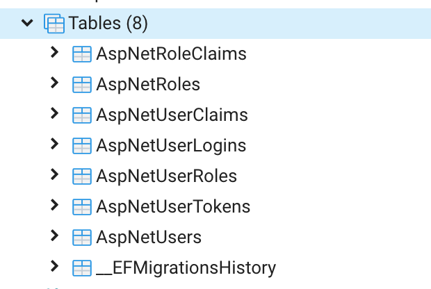

# OAuth 2 - setup - google sign in

## create dotnet mvc app with auth 
```bash
dotnet new mvc --auth Individual
```

## install entity framework packages
```bash
dotnet add package Microsoft.EntityFrameworkCore.SqlServer


// - only if you want to use postgres:
// - postgress start
dotnet add package Npgsql.EntityFrameworkCore.PostgreSQL.Design
dotnet add package Npgsql.EntityFrameworkCore.PostgreSQL
// - postgress stop

dotnet add package Microsoft.EntityFrameworkCore.Design
```

## change default connection in appsettings.json

```json
{
  "ConnectionStrings": {
    "DefaultConnection": "DataSource=app.db"
  },
  "Logging": {
    "LogLevel": {
      "Default": "Information",
      "Microsoft": "Warning",
      "Microsoft.Hosting.Lifetime": "Information"
    }
  },
  "AllowedHosts": "*"
}
```

### for postgress
*This is an example default connection strings, update with your settings*
```json
"DefaultConnection": "Host=localhost;Port=54320;Database=demo_oauth;Username=homestead;Password=secret"
```
### for sql server

*This is an example default connection strings, update with your settings*

watch out: use a \\\\ in Data Source!

```json
"DefaultConnection": "Data Source=639GTQ2\\SQLEXPRESS;Initial Catalog=demo_oauth;Integrated Security=True;"  
```

## change options.UseSqslite in the ConfigureServices method in Startup.cs 

```C#
        public void ConfigureServices(IServiceCollection services)
        {
            services.AddDbContext<ApplicationDbContext>(options =>
                options.UseNpgsql( // CHANGED LINE
                    Configuration.GetConnectionString("DefaultConnection")));
            services.AddDefaultIdentity<IdentityUser>(options => options.SignIn.RequireConfirmedAccount = true; )
                .AddRoles<IdentityRole>() 
                .AddEntityFrameworkStores<ApplicationDbContext>();
            services.AddControllersWithViews();
           services.AddRazorPages();
        }
```

## for postgress
options.UseNpgsql

## for sql server
options.UseSqlServer

## delete and recreate Data/Migrations folder
- delete Migrations folder
- run commands:

```bash
dotnet ef migrations add Initial -o Data/Migrations
dotnet ef database update
```

## check if the identity tables are created in de database


## enable (if not enabled yet) authentication middleware

```C#
public void Configure(IApplicationBuilder app, IWebHostEnvironment env, IServiceProvider serviceProvider)
        {
            ...

            app.UseRouting();

            app.UseAuthentication(); // NEW LINE ADDED
            app.UseAuthorization();

            ...      
        }
```
## Setup google sign in
- install Microsoft.AspNetCore.Authentication.Google.
- Navigate to Integrating Google Sign-In into your web app and select CONFIGURE A PROJECT. (https://developers.google.com/identity/sign-in/web/sign-in)
- In the Configure your OAuth client dialog, select Web server.
- In the Authorized redirect URIs text entry box, set the redirect URI. For example, https://localhost:44312/signin-google


## Save OAuth secret + id
```bash
dotnet user-secrets init
dotnet user-secrets set "Authentication:Google:ClientId" "<client-id>"
dotnet user-secrets set "Authentication:Google:ClientSecret" "<client-secret>"
```

## Startup.cs
Add the following code at the bottom of the **ConfigureServices** method.

```bash
services.AddAuthentication()
        .AddGoogle(options =>
        {
            IConfigurationSection googleAuthNSection =
                Configuration.GetSection("Authentication:Google");

            options.ClientId = googleAuthNSection["ClientId"];
            options.ClientSecret = googleAuthNSection["ClientSecret"];
        });
```  

## test app

```bash
dotnet build
dotnet run
```
Try to sign in with a google account.


## Roles & authorization

This is accomplished by the dotnet identity framework.

See Identity lesson & cheat sheet.