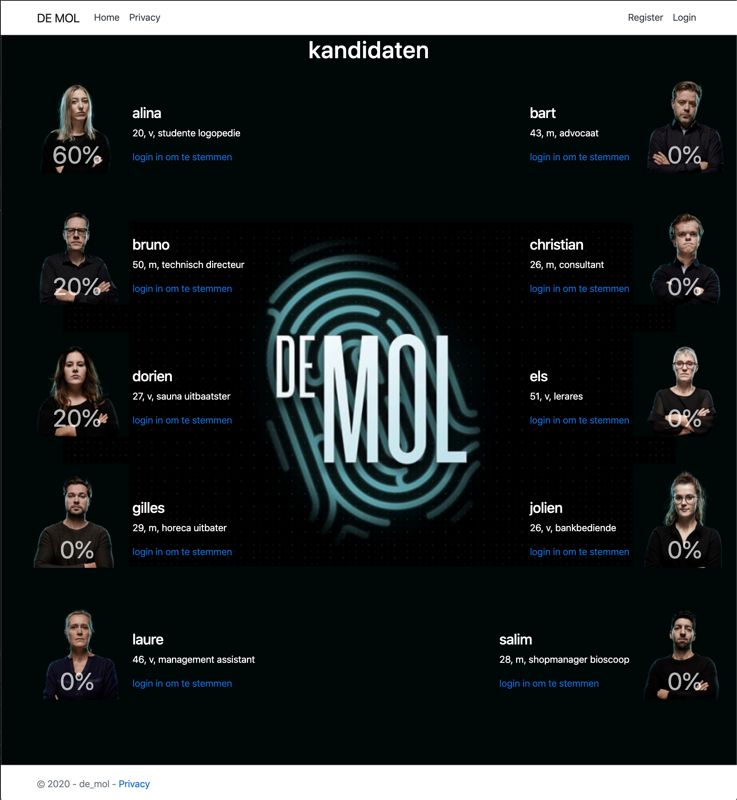
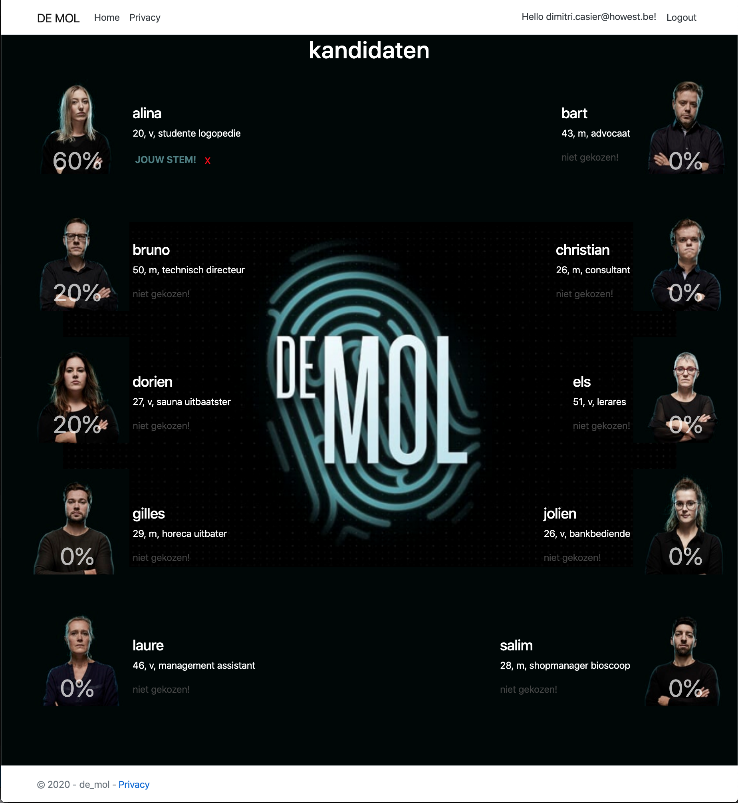
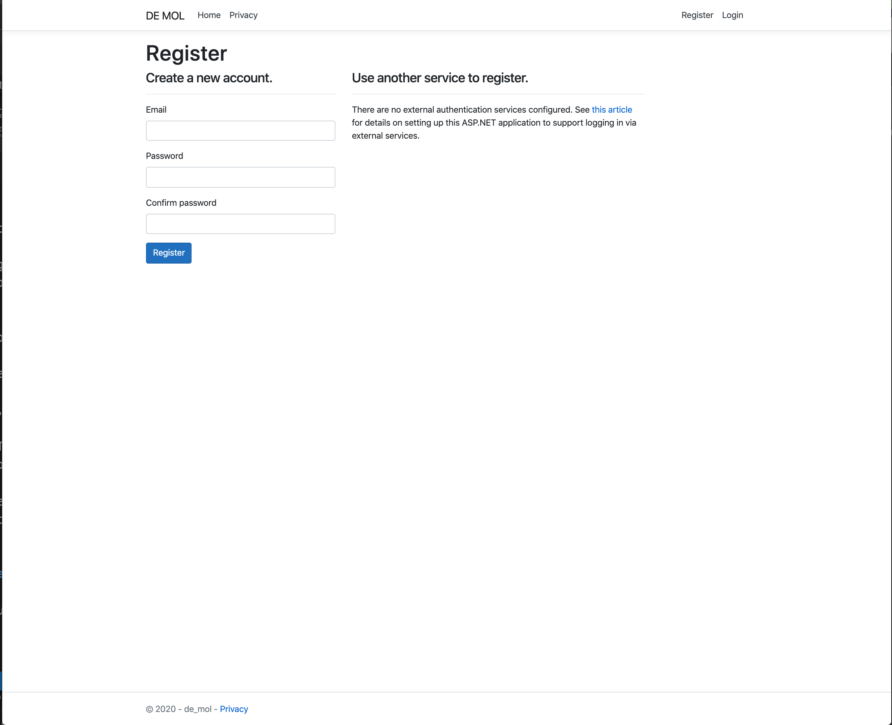
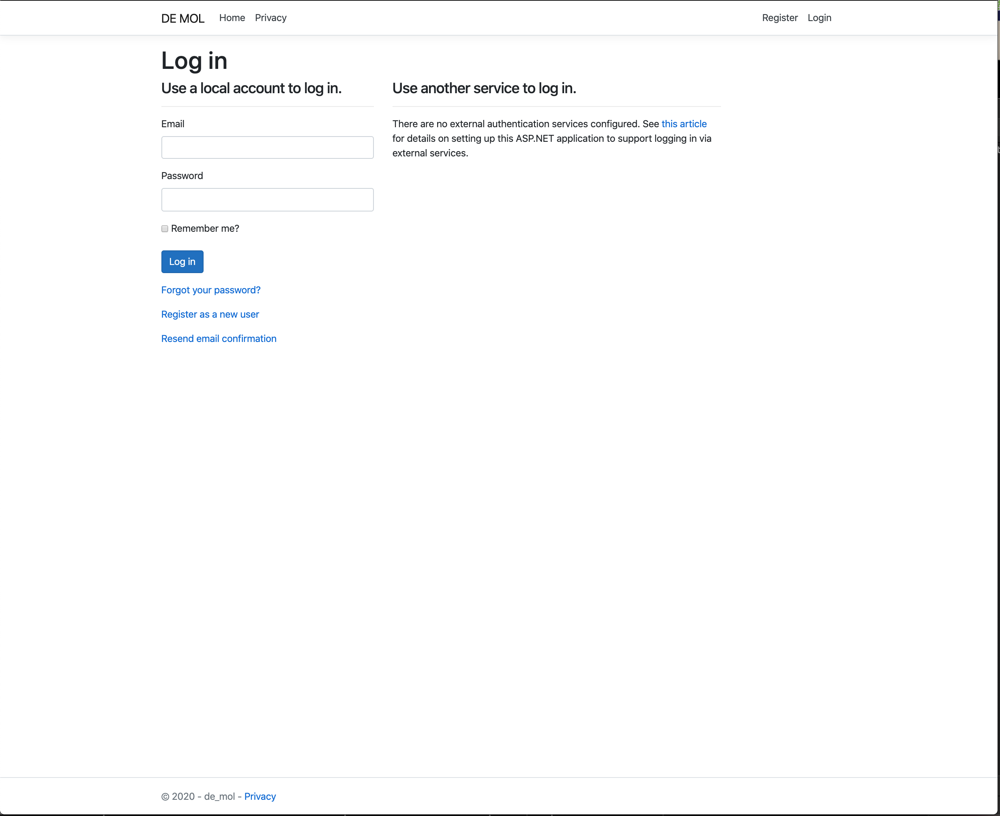

# DE MOL - IDENTITY
This MVC application shows how to create a dotnet core Identity application.
  - Focus
    - authentication: register + login
    - authorization: authorized + roles

# Purpose
Create an MVC app "DE MOL", where you can vote on your suspect.

- A user can only vote when is logged in
- A user can register and login
- When a user creates a new account, she/he gets the role Member
- Each user can only vote once (per episode)
- A user with the role Member CANNOT change her/his vote, a user with the role Admin CAN change her/his vote (see red cross sign)
- This application is build to vote for the first episode of DE MOL only. KEEP IN MIND that your code should be written so that it easily can be changed into an application where a logged in user can vote ONCE PER EPISODE  , in total 8 episodes. (don't implement it, but write your code so that this change can easily happen)

## Extra (not on screenshots, be creative!):
- Make it possible that a logged in user can vote once per episode. (implement it!)
- Don't mind the eliminated users (unless you have the ambition to do so :P)

## Screenshots:

### homepage as anonymous user

### homepage as logged in user (is this a user with role Amdin)

### register page

### login page

# Requirements
- use viewmodel(s)
- use a service layer

# Hints
- watch the video about dotnet core Identity
- use the cheatsheets

 
# How to start
- preprare an mvc with identity by following the instructions on the dotnet-identity cheatsheet
- run the sql scripts (see dumps folder) and scaffold with enitity framework 
- copy paste the images folder from the dumps folder to wwwroot
- use the AuthSeeder to seed the Identity tables
- start coding and HAVE FUNs!