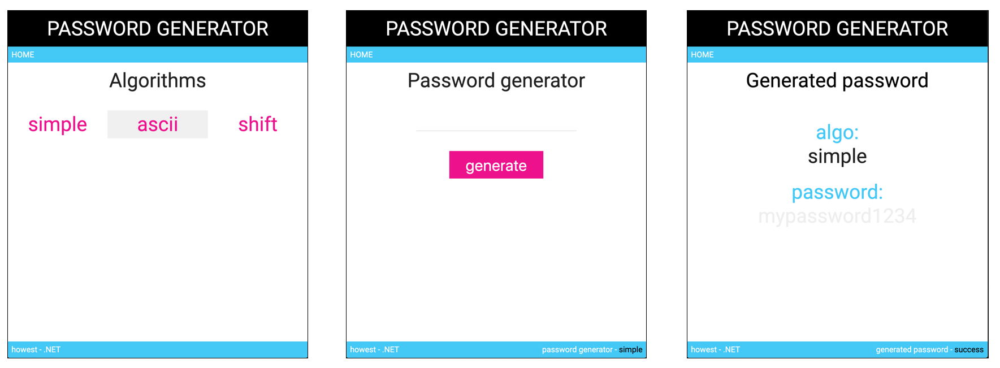

# Password app - MVC
This MVC application learns how to use the master/view sections of MVC in dotnet core. It is also a recap of  how to (create) and use a library in an MVC application.

  - Focus
    - **Master/View sections**: Layout in an MVC.
    - **Creating a library** from an exsiting console app
    - **Adding a library**  to your MVC
    - **Using ViewModels**: Specific models for a view
   

# Purpose
Create a password MVC application based on a the password console app.

Start from the code form the password-algo console app and librarify your code.
Add the library to your MVC Application.  At the end of the excercise you will have 2 repositories, one for the MVC webapplication and one for the library.

Use master/view sections to create the 3 pages. And don't forget to use ViewModels for your views.

- **page 1**
  - **title:** Algorithms
  - **url:** /algorithms
  - **description:**
  This page shows  the algorithms you can use (in a list). Each algorithm is a link to page 2.
- **page 2**
  - **title:** Password generator
  - **url:** /password/{algo} _(algo: simple, ascii or shift)_
  - **description:**
  After typing a password (int the password field) and when clicking on the generate button, a POST request is send to _/password/{algo}/generate_ and the password is generated based on the given algorithm. 
- **page 3**
  - **title:** Password generator
  - **url:** /password/{algo}/generate  _(algo: simple, ascii or shift)_
  - **description:** 
  On this page you will see the generated password and the algorithm that was used. If the algotirthm doesn't exists, display an error message instead.
  
# Hints
- Please watch video and slides.
- Checkout the corresponding topic repos and try to understand the code.
- Checkout the lecture about creating and adding a library
- You don't net a database!

# Requirements
- 3 pages
- master/view sections
- ViewModels
- password-algo library
- 2 repositories
  - password-mvc
  - password-library

**HAVE FUN!!!**

